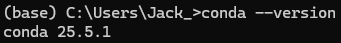
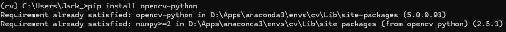
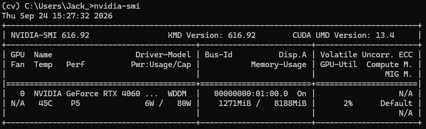
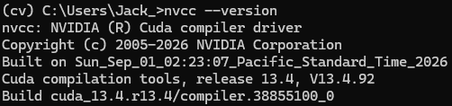
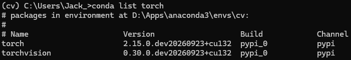
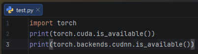
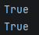

# 实验一：计算机视觉库的安装
## 实验目的
掌握 Anaconda 的安装与基本操作，熟悉 GPU 使用环境的配置及对应版本 PyTorch 的安装，并完成 OpenCV 的安装与配置
## 实验内容
### 1. Anaconda的安装及配置
（之前已经下载过了，只展示结果）

### 2. conda的基本操作与OpenCV的安装

### 3. GPU加速环境配置
1. nvidia-smi 显示显卡状态信息，如下：

2. 在NVIDIA官网下载对应版本的CUDA Toolkit及cuDNN并安装，这里不在进行演示。以
下为验证CUDA是否安装成功（cuDNN不能单独运行，后面结合Pytorch验证，这里不做
验证）：

### 4. PyTorch安装

### 5. PyTorch GPU加速环境验证

## 实验结果
成功安装Anaconda，OpenCV，CUDA，PyTorch
## 实验总结
1.此次实验较为基础，主要是后续CV实验搭建实验环境。
2.熟悉了Anaconda虚拟环境管理的基本操作。
3.结合CUDA与cuDNN配置了GPU加速环境，为深层网络的高效训练奠定了基础。