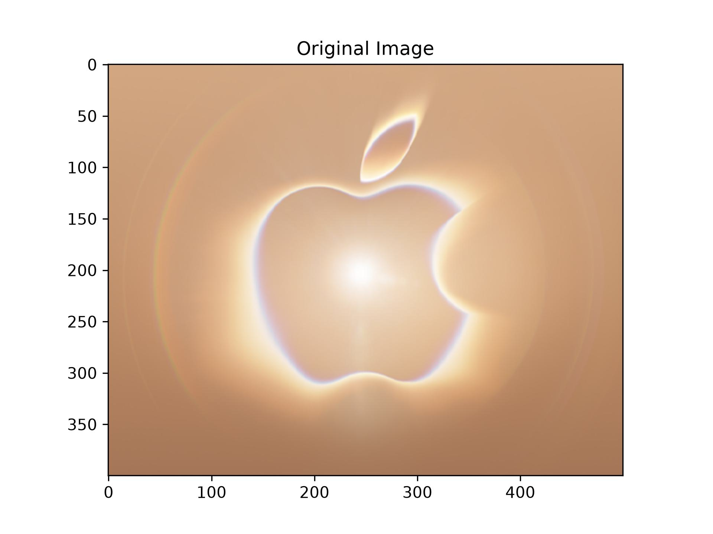
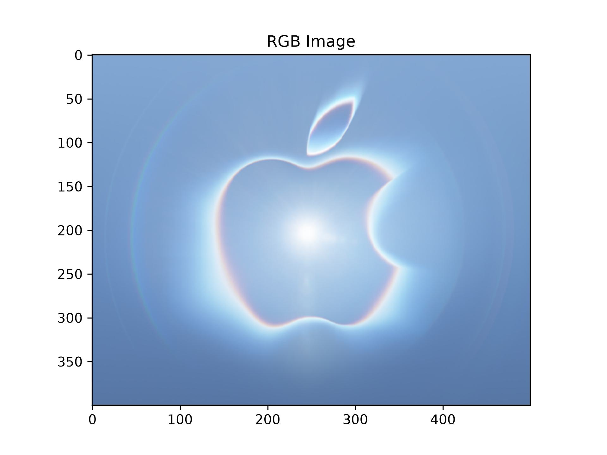
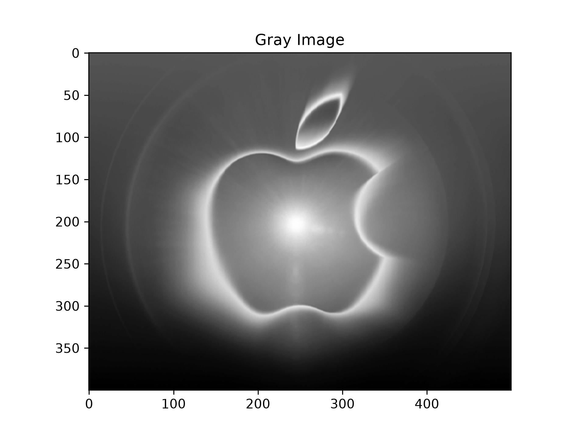
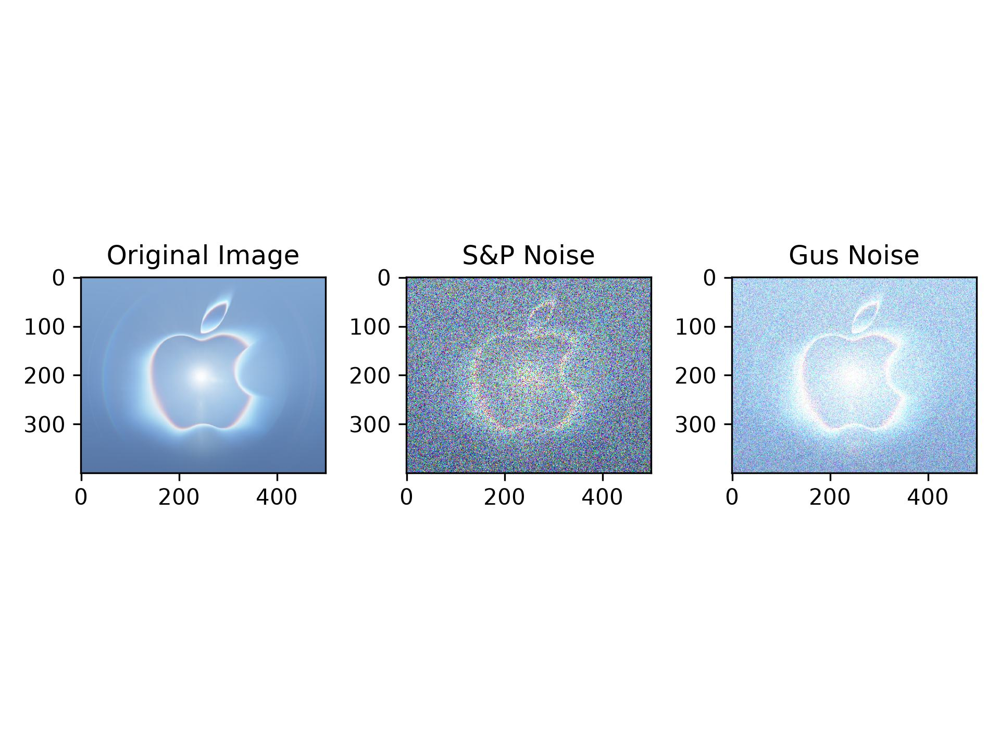
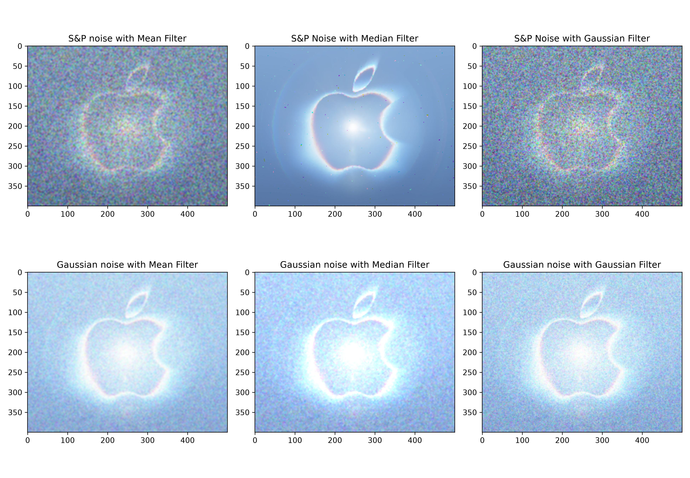
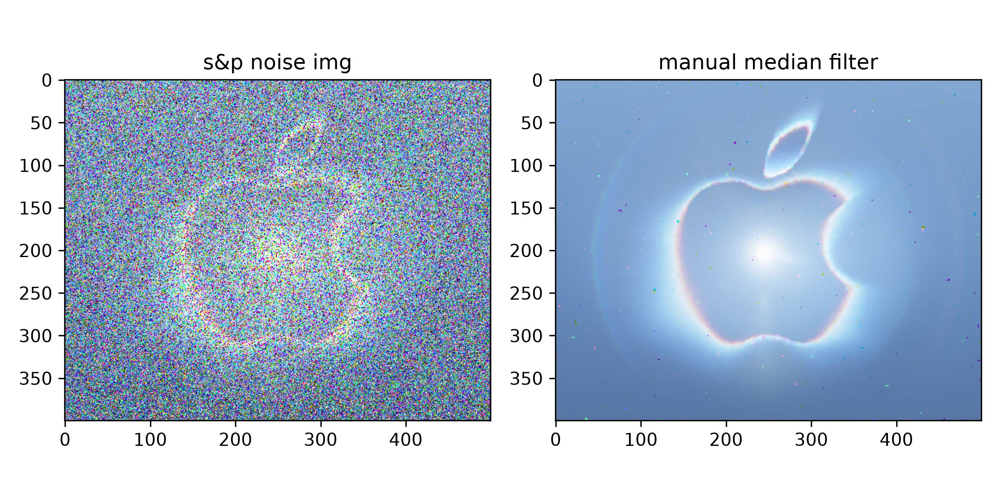

# 实验二：图像增强参考文档
## 一、实验目的
学会OpenCV的基本使用方法，利用OpenCV等计算机库对图像进行平滑、滤波等操作，实现图像增强。
## 二、实验内容
### 2.1 导入图像滤波相关的依赖包
* 1.OpenCV库：计算机视觉与图像处理
* 2.scikit-image库：图像增强与分析，random_noise 用于给图像添加噪声
* 3.NumPy库：科学计算的基础库
* 4.Matplotlib库：绘图与数据可视化
```python
# =====================导入依赖库=====================
import cv2
from skimage.util import random_noise
import numpy as np
from matplotlib import pyplot as plt
```
### 2.2 读取原始图像并进行色彩空间转换
读取计算机本地图像文件，获取并输入【100，100】处像素点的RBG参数并输出,通过下面的输出结果可以看到，【100,100】像素点的RGB为【82,86,241】，表现为偏蓝色，通过图像也可以看到这个像素点属于猫猫的衣服处的深蓝色部位。
```python
# ====================读取原始图像=====================
img = cv2.imread('p1.jpg')
# 获取图像中【100，100】这个像素的rbg三色
(b, g, r) = img[100, 100]
# 打印这个像素点的rbg参数
print(b, g, r)
# 输出原始图像
plt.imshow(img)
plt.title('Original Image')
plt.savefig('output_images/original_bgr.jpg', dpi=300)
plt.show()
```
```
输出：
72 84 242
```
原图：

然后测试一下cv2中颜色空间变换的效果，这里的cv2.cvtColor就是颜色空间转换，cv2.COLOR_BGR2RGB代表的是将原始图像BGR格式转换成RGB格式，蓝色和红色互换，因为把'B'和'R'通道互换了，所以这是一个红蓝的颜色反转
```python
# 颜色空间转换，将原始图像BGR格式 转换成 RGB格式，蓝色和红色互换，因为把'B'和
rgb_img = cv2.cvtColor(img, cv2.COLOR_BGR2RGB)
plt.imshow(rgb_img)
plt.title('RGB Image')
plt.savefig('output_images/rgb_image.jpg', dpi=300)
plt.show()
```
红蓝反转图：

cv2.COLOR_BGR2GRAY是将原始图像的RBG格式转换为灰度图，将三维的RGB通道映射为一维的灰度通道
```python
# 将原始图像的RBG格式转换为灰度图
gray_img = cv2.cvtColor(img, cv2.COLOR_BGR2GRAY)
plt.imshow(gray_img, cmap='gray')
plt.title('Gray Image')
plt.savefig('output_images/gray_image.jpg', dpi=300)
plt.show()
```
灰度图：

## 2.3 添加噪声
这里在原始图像的基础上添加噪声，引入了两个API方法，椒盐噪声和高斯噪声，通过对比可以发现，椒盐噪声和高斯噪声的本质不同，椒盐噪声表现为像素会随机替换为白色或者黑色像素（灰度通道），在RGB通道表现为像素变成随机彩色点，而高斯噪声会在每个像素上添加随机偏差，服从高斯分布
```python
# ==========================添加噪声=========================
# mode='s&p'代表椒盐噪声，s代表白色，p代表黑色，amount=0.4代表会有40%的像素
sp_noise_img = random_noise(rgb_img, mode='s&p', amount=0.4)
# mode='gaussian' 代表高斯噪声，会在每个像素上添加随机偏差，服从高斯分布（均值
gus_noise_img = random_noise(rgb_img, mode='gaussian', mean=0.2, var=0.03)
# 原图
plt.subplot(1, 3, 1)
plt.imshow(rgb_img, cmap='gray')
plt.title('Original Image')
# 椒盐噪声
plt.subplot(1, 3, 2)
plt.imshow(sp_noise_img, cmap='gray')
plt.title('S&P Noise')
# 高斯噪声
plt.subplot(1, 3, 3)
plt.imshow(gus_noise_img, cmap='gray')
plt.title('Gus Noise')
plt.tight_layout()
plt.savefig('output_images/noise_comparison.jpg', dpi=300)
plt.show()
```
噪声对比图：

## 2.4 图像滤波
将图像认为产生噪声后，用OpenCV的三个API滤波方式进行对比，分别对椒盐滤波和高斯滤波使用【均值滤波】，【中值滤波】，【高斯滤波】，对比每个最适合的滤波方式。
```python
# =========================图像滤波=============================
# 均值滤波
mean_sp = cv2.blur(sp_noise_img, (5, 5))
mean_gus = cv2.blur(gus_noise_img, (5, 5))
# 中值滤波（需要 uint8）
mid_sp = cv2.medianBlur((sp_noise_img*255).astype(np.uint8), 5)
mid_gus = cv2.medianBlur((gus_noise_img*255).astype(np.uint8), 5)
# 高斯滤波
gauss_sp = cv2.GaussianBlur((sp_noise_img*255).astype(np.uint8), (5, 5), 0)
gauss_gus = cv2.GaussianBlur((gus_noise_img*255).astype(np.uint8), (5, 5), 0)
# 图像显示
plt.figure(figsize=(13, 9))
# 第1行：椒盐噪声
plt.subplot(2, 3, 1)
plt.imshow(mean_sp)
plt.title("S&P noise with Mean Filter")
plt.subplot(2, 3, 2)
plt.imshow(mid_sp)
plt.title("S&P Noise with Median Filter")
plt.subplot(2, 3, 3)
plt.imshow(gauss_sp)
plt.title("S&P Noise with Gaussian Filter")
# 第2行：高斯噪声
plt.subplot(2, 3, 4)
plt.imshow(mean_gus)
plt.title("Gaussian noise with Mean Filter")
plt.subplot(2, 3, 5)
plt.imshow(mid_gus)
plt.title("Gaussian noise with Median Filter")
plt.subplot(2, 3, 6)
plt.imshow(gauss_gus)
plt.title("Gaussian noise with Gaussian Filter")
plt.tight_layout()
plt.savefig('output_images/filter_results_2x3.jpg', dpi=300)
plt.show()
```
图像滤波对比图：

### 2.5 手动实现一个滤波方式（中值滤波）
```python
def manual_median_filter_color(image, kernel_size=5):
    pad = kernel_size // 2
    filtered_img = np.zeros_like(image)
    for c in range(3): 
        channel = image[:, :, c]
        padded_channel = np.pad(channel, pad_width=pad, mode='edge')
        for i in range(channel.shape[0]):
            for j in range(channel.shape[1]):
                region = padded_channel[i:i + kernel_size, j:j + kernel_size]
                filtered_img[i, j, c] = np.median(region)
    return filtered_img
    
manual_mid = manual_median_filter_color((sp_noise_img * 255).astype(np.uint8))

plt.figure(figsize=(8, 4))
plt.subplot(1, 2, 1)
plt.imshow(sp_noise_img, cmap='gray')
plt.title("s&p noise img")
plt.subplot(1, 2, 2)
plt.imshow(manual_mid, cmap='gray')
plt.title("manual median filter")
plt.tight_layout()
plt.savefig('output_images/manual_median.jpg', dpi=300)
plt.show()
```
手动构建中值滤波效果图：

## 三、实验结果与分析
### 1. 原始图像与颜色空间转换
* 使用 OpenCV 读取并显示原始彩色图像，能够清晰观察到图像的细节信息。
* 将 BGR 格式转换为 RGB 格式后，颜色显示更符合人眼视觉认知，红、绿、蓝三个通道正确对应。
* 灰度图则突出了图像的亮度信息，有助于后续的图像处理与分析。
### 2. 噪声添加效果
* 椒盐噪声（S&P Noise） 

  图像中随机出现黑白像素点，局部区域破坏明显。
* 高斯噪声（Gaussian Noise）

  图像整体亮度出现轻微抖动，噪声分布更均匀，细节略微模糊。

对比实验表明：椒盐噪声的局部破坏更显著，而高斯噪声则影响图像的整体视觉效果。
### 3. 滤波去噪效果
* 均值滤波（Mean Filter）：

  对高斯噪声的去除效果较好，能够平滑整幅图像；但对椒盐噪声中的尖锐黑白点去除不彻底，且容易造成边缘模糊。
* 中值滤波（cv2.medianBlur） 

  对椒盐噪声的去除效果显著，能有效保留图像边缘和细节；对高斯噪声也有一定抑制作用，但整体去噪效果略逊于均值滤波。
* 高斯滤波（cv2.GaussianBlur）

  对高斯噪声的去除效果最佳，平滑自然，且能保留一定的边缘信息；但对椒盐噪声的处理能力有限，因为椒盐噪声是突变型噪声，而非连续分布。
* 手动实现中值滤波（彩色）

  效果与 OpenCV 自带的中值滤波基本一致，能有效去除彩色图像中的椒盐噪声，并保持颜色真实和边缘清晰。实验验证了对彩色图像应分别对 R、G、B 三通道独立滤波的合理性。

  通过对比显示，手动中值滤波在保持彩色信息和边缘清晰度方面表现良好，说明处理彩色图像时需要对每个通道分别滤波。
### 总体分析
不同类型的噪声适合采用不同的滤波方法进行去噪处理：
* 椒盐噪声（Salt & Pepper Noise）

  属于突变型噪声，适合采用中值滤波（Median Filter），能有效去除孤立的黑白噪点，同时较好地保留图像边缘细节。
* 高斯噪声（Gaussian Noise）

  属于连续型噪声，适合采用均值滤波（Mean Filter）或高斯滤波（Gaussian Filter）进行平滑处理，能够在抑制噪声的同时保持较自然的视觉效果。

  手动实现的彩色中值滤波不仅复现了 OpenCV 中的滤波效果，还加深了对滤波原理的理解。在实现过程中，通过分别对 R、G、B 三个通道独立处理，能够灵活调整滤波核大小和算法逻辑，为后续针对不同噪声类型的自定义滤波与优化提供了良好的基础。


## 四、实验小结
本次实验围绕图像增强中的噪声添加与滤波去噪展开，基于 OpenCV、scikit-image、NumPy 和 Matplotlib 等库，完成了从图像读取、颜色空间转换、噪声模拟到多种滤波方法对比的完整流程，并通过手动实现中值滤波加深了对滤波原理的理解。具体总结如下：

1. 掌握了 OpenCV 的基本图像操作

   通过 cv2.imread 读取图像，利用 cv2.cvtColor 实现 BGR 与 RGB 的转换以及灰度化处理，理解了 OpenCV 默认以 BGR 格式存储图像的特点，也认识到颜色空间转换在图像显示与后续处理中的重要性。
2. 学会了两种常见噪声的模拟方法

   使用 skimage.util.random_noise 分别添加了椒盐噪声和高斯噪声。通过对比观察到：椒盐噪声表现为随机黑白像素点，属于突变型噪声；高斯噪声则是在每个像素上叠加服从高斯分布的随机偏差，属于连续型噪声。两者在视觉表现和破坏方式上有明显差异。
3. 对比了三种经典滤波方法的效果

   实验中使用均值滤波、中值滤波和高斯滤波分别处理椒盐噪声和高斯噪声，得出以下结论：
   * 椒盐噪声更适合用中值滤波去除，因其能有效消除孤立的黑白噪点，同时较好地保留边缘细节；
   * 高斯噪声更适合用均值滤波或高斯滤波处理，能够平滑图像并抑制连续型噪声；
   * 均值滤波虽然对高斯噪声效果较好，但容易造成边缘模糊；高斯滤波则在平滑性和边缘保留之间取得了较好的平衡。
4. 手动实现了彩色图像的中值滤波

   通过分别对 R、G、B 三个通道独立进行中值滤波，成功复现了 OpenCV 自带中值滤波的效果。实验验证了彩色图像滤波应对各通道分别处理的合理性，也加深了对滤波核、边界填充和排序取中值等原理的理解。手动实现的过程虽然计算效率较低，但为后续自定义滤波算法和针对不同噪声类型的优化提供了基础。
5. 提升了实验分析与对比能力
    
   通过多组对照实验和可视化展示，能够根据不同噪声类型和滤波结果，分析各方法的优缺点及适用场景。这不仅巩固了图像增强的理论知识，也提高了使用 Python 和 OpenCV 进行图像处理的实际动手能力。

综上所述，本次实验达到了预期目的，既掌握了图像噪声添加与滤波的基本方法，又通过手动实现滤波算法加深了对图像增强原理的理解，为后续学习更复杂的图像处理技术打下了良好基础。